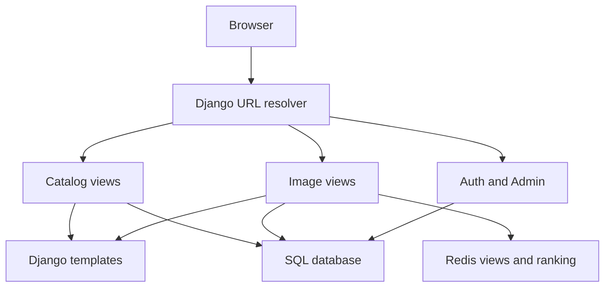
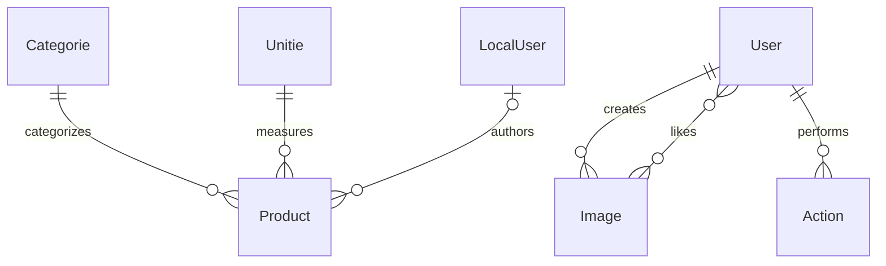
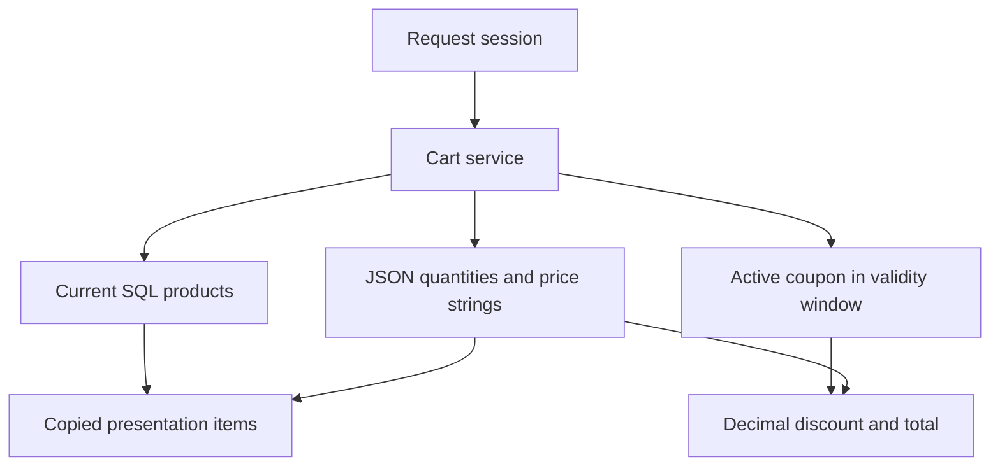

# Architecture — django-pets

## Runtime components

Catalog routes are mounted at the root; image routes at `/images/`; authentication at `/accounts/`; administration at `/admin/`. Debug-toolbar routes exist only in development. The optional session cart and coupon URL modules are tested independently and can be mounted at `/basket/` and `/coupons/`.

## Domain and persistence

| App | Ownership |
| --- | --- |
| `fructs` | Products, categories, units, presentation metadata and legacy subscription records |
| `cart` | Session-backed item quantities and price snapshots; no cart table |
| `coupons` | Percentage discounts with active state and validity dates |
| `images` | Bookmark metadata, media paths, like relationships and denormalized like counts |
| `actions` | User activities with optional generic targets through content types |
| `emails` | Placeholder with no implemented delivery service |

`Product.label` cascades with its category. `Product.unite` uses `DO_NOTHING`: callers must avoid deleting referenced units without a separate data policy. `LocalUser` extends Django's concrete user model through multi-table inheritance, while images and actions reference the normal auth user. `SubscribeModel` belongs to the uninstalled legacy `appname` label and is not part of the active migration schema.

## Catalog request flow

Each request calls `setContext()` to create a fresh context and fresh querysets. It fetches the first optional location rather than requiring one. Demo and normal products are filtered in SQL. Paginator `get_page()` handles malformed or out-of-range page values. Product detail uses `get_object_or_404`; optional image fields are guarded in templates. No database queries execute when the view module is imported.

Breadcrumbs are optional. Checkout renders its own presentation template. The unfinished subscription handler returns 501 for POST and 405 for other methods, giving callers an explicit result instead of returning no response.

## Session cart boundary

Item keys are string product IDs; prices are strings and quantities are positive integers. Iteration builds separate dictionaries containing model instances and Decimals, preserving session serialization. Deleted products are pruned during iteration. Prices are snapshots at addition time; there is no stock or currency policy. Clear resets both cart contents and coupon selection. Coupon eligibility is checked again when reading the cart, not just when applying a code. Percentage bounds are model validators.

The session backend stores the cart. Cart and coupon views use POST for mutations and Django CSRF middleware. The optional cart template is minimal; storefront actions have not been wired to those endpoints.

## Images and activities

Image creation downloads a remote resource through the form and writes it through Django's storage API. A timeout and HTTP status check bound ordinary network failures; destination, size and content restrictions remain future work. Likes are SQL many-to-many relations. Post-change signals update `total_likes` from either relation direction, with a pre-clear snapshot for reverse clears.

Redis uses `image:<id>:views` counters and the `image_ranking` sorted set. The database remains authoritative for image records; ranking rendering skips entries whose SQL image was deleted. Redis availability is required by detail/ranking views and has no fallback in this version. `create_action()` suppresses similar activities during a one-minute window; this query-then-create behavior is not an atomic guarantee under concurrent requests.

## Configuration and tests

Base settings define common dependencies and read `.env`. Development enables SQLite-compatible operation and the toolbar. Production requires a database URL and disables debug. Test settings use an in-memory database, in-memory email and a test secret; Redis calls are mocked. The coupon initial migration is included so normal deployments create its table. GitHub Actions runs model, route, session, coupon, image and activity regression tests plus migration consistency checks.
